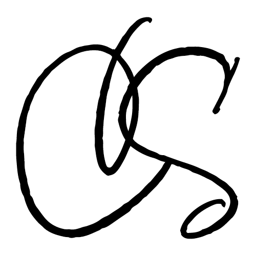

Essa página está em  Português.
To view this page in  English, [click here](./README.md).

#  Portfolio 1.0

Portfólio que exibe projetos de desenvolvimento e design.

## 🖼️ Screenshot

## 🔗 Link

- [camilasalles.dev](https://www.camilasalles.dev/pt-br.html)

## 👩‍💻 Autoria

- [@miaslls](https://github.com/miaslls)

## 🫶 Recursos

- [freepik](https://www.freepik.com/)
- [Adobe Fonts](https://fonts.adobe.com/)
