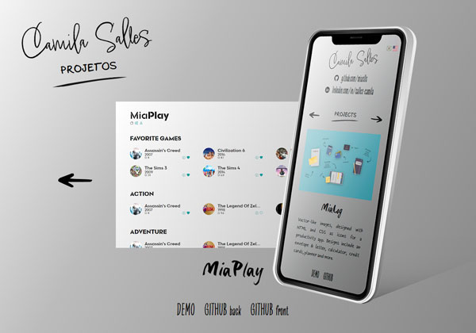

This page is in  English.
Para visualizar essa página em  Português, [clique aqui](./README-ptbr.md).

#  Portfolio 1.0

Portfolio page showcasing development and design projects.

## 🔗 Link

- [portfolio-01.camilasalles.dev](https://portfolio-01.camilasalles.dev/)

## 🖼️ Screenshot

## 👩‍💻 Authors

- [@miaslls](https://github.com/miaslls)

## 🫶 Acknowledgements

- [freepik](https://www.freepik.com/)
- [Adobe Fonts](https://fonts.adobe.com/)
